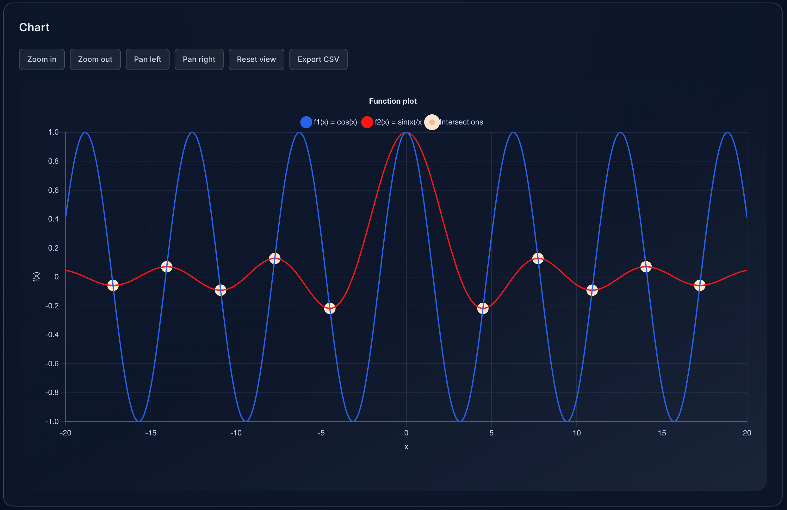

# Function & Dataset Grapher

This project bundles a full-featured plotting playground built with **React 19**, **TypeScript**, **Vite**, and **Chart.js/React Chart.js 2**. Users can mix analytic functions with imported datasets, inspect statistics, and explore the graph with smooth zooming/panning. A polished UI with light/dark theming keeps the experience friendly on desktop and touch devices alike.



## ✨ Highlights

- Plot unlimited (practically) analytic expressions using familiar math syntax (`sin(x)`, `x^2`, `log(x, base)`, etc.).
- Import CSV/TSV/Excel data series, edit points inline, and compare them alongside formula-based curves.
- Interactive viewport with mouse-wheel zoom, drag-to-pan, toolbar shortcuts, and auto-computed intersection markers.
- Light/dark theme toggle stored in `localStorage` and synced with system preferences.
- Export combined chart data as CSV, review sampling stats, warnings, and area-under-curve summaries when fills are enabled.

## 🚀 Getting Started

```bash
npm install
npm run dev
```

Dev server runs on the default Vite port (`5173`). Hot module reloading is enabled via React Compiler.

### Building for production

```bash
npm run build
npm run preview
```

> **Note**: The repo currently targets Node.js ≥ 20.19 (or 22.12). Running the build on older versions (e.g. 18.x) will emit a warning from Vite.

## 🧮 Core Concepts

| Feature            | Details                                                                                                                                                                |
| ------------------ | ---------------------------------------------------------------------------------------------------------------------------------------------------------------------- |
| Function plotting  | Expressions are parsed/sanitised (`src/utils/evaluateExpression.ts`) and sampled over a configurable domain. Auto step adjustment prevents >5k points.               |
| Dataset management | `useDatasetManager` handles CRUD, file imports, per-point edits, and selection. `useDatasetPlot` normalises series for chart consumption and produces stats.       |
| Composition        | `useChartComposition` merges function & dataset outputs and deduplicates warnings. `mergeChartData` interleaves labels so all series align.                        |
| Viewport           | `useChartViewport` tracks bounds, providing zoom & pan logic consumed by `ChartDisplay`. Drag gestures translate the window; wheel zoom honours the cursor anchor. |
| Display            | `ChartDisplay` houses the Chart.js `<Line>` instance, renders toolbar controls, overlays intersection markers via a custom plugin, and syncs tooltip copy.         |
| Theming            | `useThemePreference` + `ThemeToggle` maintain a persistent light/dark palette. Tailored CSS variables (`src/index.css`) restyle panels, inputs, borders, etc.    |

## 🧭 Project Structure

```
src/
├── components/
│   ├── chart/          # ChartDisplay, toolbar, intersection UI
│   ├── controls/       # Function control forms
│   ├── datasets/       # Dataset cards & importer
│   ├── info/           # Summary panels, warnings, instructions
│   ├── layout/         # Theme toggle, mode toggle
│   └── common/         # Shared panel component
├── hooks/              # State managers (functions, datasets, viewport, theme…)
├── utils/              # Expression parser, data merging, helpers
├── types/plot.ts       # Core domain types
└── App.tsx             # Application composition & layout
```

## 🛠️ Commands

| Script              | Purpose                                 |
| ------------------- | --------------------------------------- |
| `npm run dev`     | Start Vite dev server with HMR          |
| `npm run build`   | Type-check then build production bundle |
| `npm run preview` | Preview production output locally       |
| `npm run lint`    | Run ESLint across the codebase          |

## 📦 Dependencies

- **Runtime**: `react`, `react-dom`, `chart.js`, `react-chartjs-2`, `tailwindcss`
- **Tooling**: `vite`, `typescript`, `@vitejs/plugin-react`, `babel-plugin-react-compiler`
- **Linting**: `eslint`, `@eslint/js`, `typescript-eslint`, `eslint-plugin-react-hooks`, `eslint-plugin-react-refresh`

## 📚 Usage Tips

- Toggle between **Function** and **Dataset** modes to focus controls.
- Use the zoom buttons or scroll wheel to adjust the domain; drag the chart surface to pan.
- Enable “Fill area” to shade series and unlock automatic area-under-curve metrics shown in the summaries.
- Hover intersection points (highlighted dots) to view the meeting coordinates and series names in the tooltip.
- Theme toggle (header) persists your preference; defaults to OS theme.

## 🧩 Future Ideas

- Annotate notable features (maxima/minima) directly on the chart.
- Add keyboard shortcuts for viewport control.
- Support more advanced expression helpers (piecewise, conditionals).

---

Enjoy exploring functions and data on the same interactive canvas!
